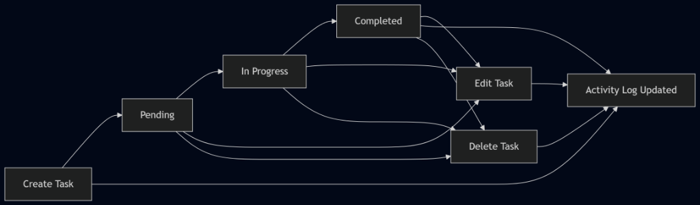
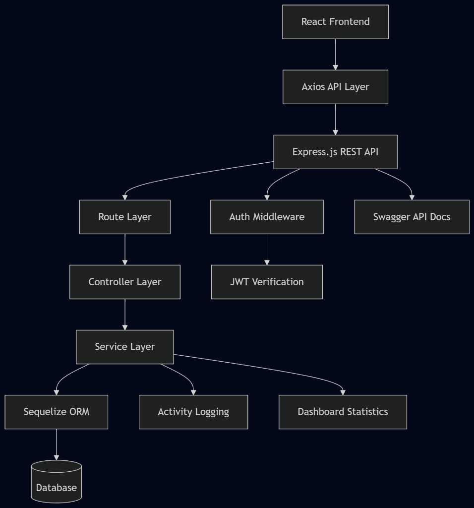
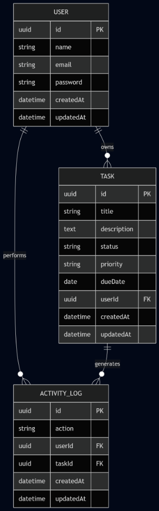
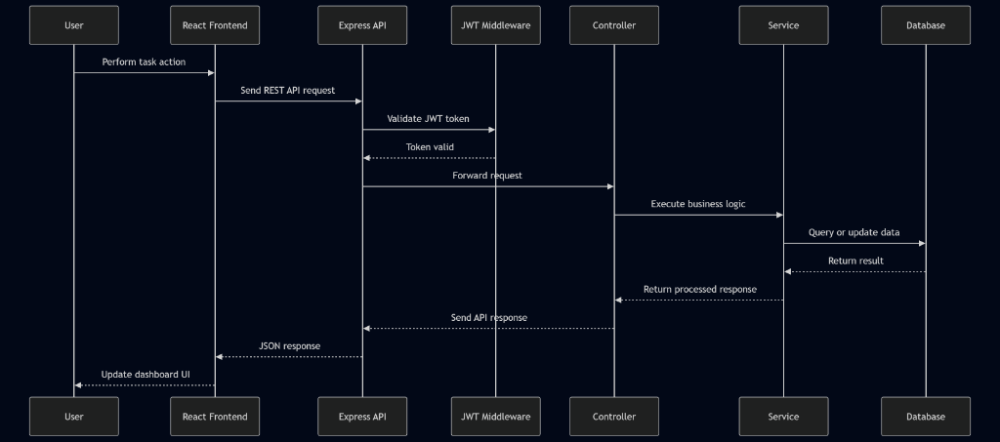
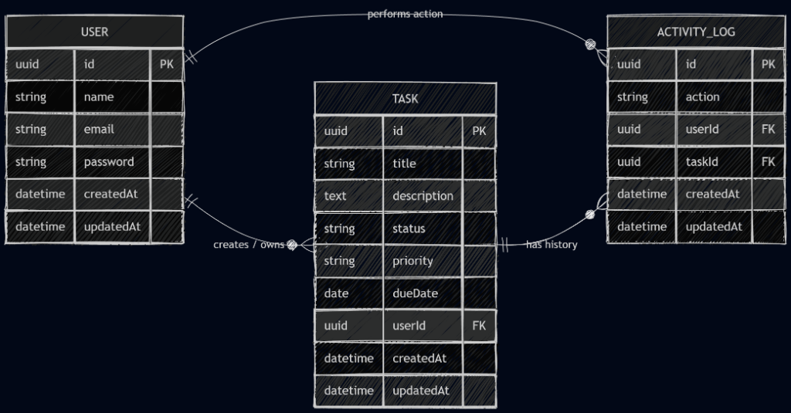
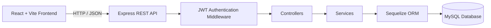
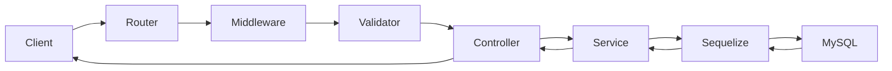
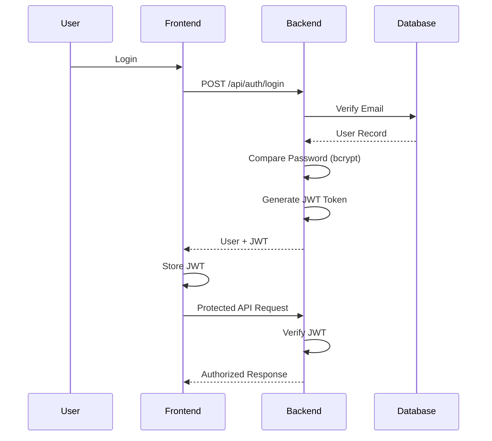
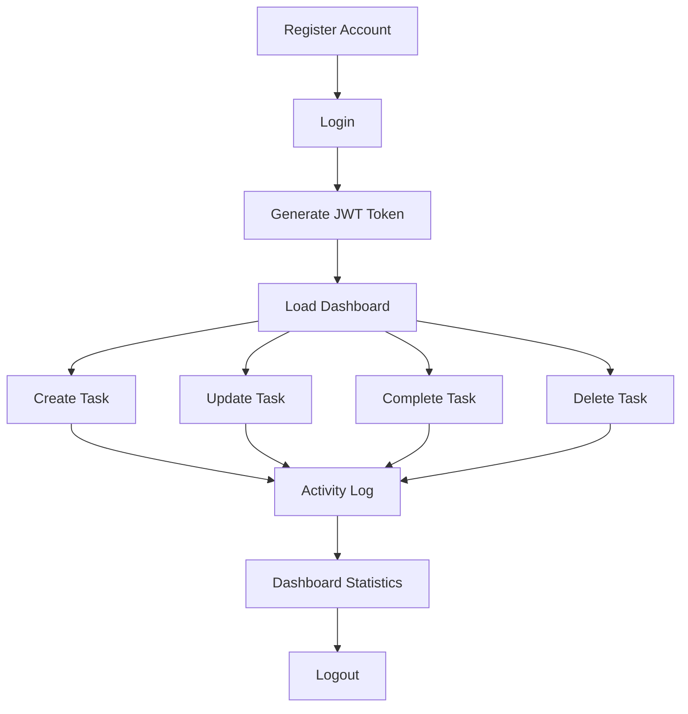
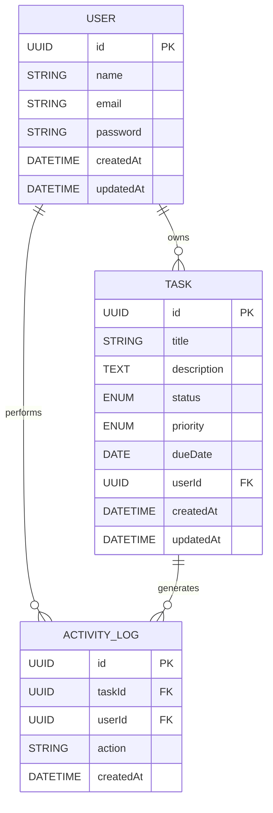

# TaskFlow - Full-Stack Task Management Workspace

  
  
  
  
  
  
  
  

----------

# Overview

TaskFlow is a production-ready full-stack task management platform built with **React**, **Node.js**, **Express.js**, **MySQL**, and **Sequelize ORM**.

The application enables users to securely manage tasks through a modern SaaS-style workspace featuring JWT authentication, productivity dashboards, timeline planning, activity tracking, and complete task lifecycle management.

Designed using a layered architecture, TaskFlow demonstrates modern software engineering practices including RESTful API development, secure authentication, request validation, modular frontend architecture, automated testing, API documentation, and cloud deployment.

This project was built to showcase real-world full-stack development skills commonly required in modern software engineering teams.

----------

# Live Demo

| Service | URL |
|---|---|
| 🌐 Frontend | [https://taskflow-project-management-ten.vercel.app](https://taskflow-project-management-ten.vercel.app/) |
| ⚙️ Backend API | [https://taskflow-project-management.onrender.com](https://taskflow-project-management.onrender.com/) |
| 📖 Swagger Documentation | [https://taskflow-project-management.onrender.com/api-docs](https://taskflow-project-management.onrender.com/api-docs) |
| 💻 GitHub Repository | [https://github.com/Jai7525/taskflow-project-management](https://github.com/Jai7525/taskflow-project-management) |

----------

# Highlights

- Secure JWT Authentication
- Complete Task Lifecycle Management (CRUD)
- Responsive SaaS Workspace
- Productivity Dashboard
- Weekly Timeline Planner
- Search, Filter & Sorting
- Activity Logging
- Protected REST APIs
- Swagger API Documentation
- Automated Backend Testing
- Production Deployment (Vercel + Render + Aiven MySQL)

----------

# Screenshots

## Dashboard

Modern productivity dashboard featuring workspace statistics, timeline planning, and task overview.



----------

## Task Board & Activity Log

Kanban-style task management with Pending, In Progress, Completed workflows and recent activity tracking.



----------

## Login

Secure JWT-based authentication with responsive SaaS interface.



----------

## Create Task

Create and organize tasks with priority, due date, and status management.



----------

## Swagger API Documentation

Interactive OpenAPI documentation for testing and exploring backend REST APIs.



----------
# Tech Stack

## Frontend

<p>
     
</p>

### Backend

<p>
  
</p>

### Database & ORM

<p>
 
</p>

### Authentication

<p>
 
</p>

### API Documentation

<p>
 
</p>

### Testing

<p>
  
</p>

### Deployment

<p>
  
</p>


# Architecture

TaskFlow follows a **layered architecture** that separates the user interface, business logic, data access, and persistence layers. This design improves maintainability, scalability, testing, and code organization while following production-ready backend development practices.

----------

# System Architecture



----------

# Backend Request Flow



----------

# Authentication Flow



----------

# 🔄 Project Workflow

The following workflow illustrates how a user interacts with TaskFlow throughout the application.



----------

# Database Design

TaskFlow uses a relational MySQL database consisting of three primary entities:

- **User**
- **Task**
- **ActivityLog**

The database is designed to maintain data integrity, preserve activity history, and support efficient task management.

----------

## User Table

```text
+--------------------------------------+
|              USER TABLE              |
+--------------------------------------+
| id (UUID)              PRIMARY KEY   |
| name (VARCHAR)                      |
| email (VARCHAR)        UNIQUE        |
| password (VARCHAR)                  |
| createdAt (TIMESTAMP)               |
| updatedAt (TIMESTAMP)               |
+--------------------------------------+
```

----------

## Task Table

```text
+--------------------------------------+
|              TASK TABLE              |
+--------------------------------------+
| id (UUID)              PRIMARY KEY   |
| title (VARCHAR)                     |
| description (TEXT)                  |
| status (ENUM)                       |
| priority (ENUM)                     |
| dueDate (DATE)                      |
| userId (UUID)         FOREIGN KEY    |
| createdAt (TIMESTAMP)               |
| updatedAt (TIMESTAMP)               |
+--------------------------------------+
```

----------

## Activity Log Table

```text
+--------------------------------------+
|         ACTIVITY_LOG TABLE           |
+--------------------------------------+
| id (UUID)              PRIMARY KEY   |
| taskId (UUID)         FOREIGN KEY    |
| userId (UUID)         FOREIGN KEY    |
| action (VARCHAR)                    |
| createdAt (TIMESTAMP)               |
+--------------------------------------+
```

----------

## Entity Relationship Diagram (ERD)



----------

## Database Relationships

```text
User (1)
   │
   ├──────────── owns ────────────┐
   │                              │
   ▼                              │
Task (Many)                       │
   │                              │
   └──────── generates ─────────► ActivityLog (Many)

User (1)
   └──────── performs ──────────► ActivityLog (Many)
```

----------

# Project Structure

```text
taskflow-project-management/
│
├── frontend/
│   ├── src/
│   │   ├── assets/
│   │   ├── components/
│   │   │   ├── feedback/
│   │   │   ├── layout/
│   │   │   ├── tasks/
│   │   │   ├── ui/
│   │   │   └── workspace/
│   │   ├── contexts/
│   │   ├── layouts/
│   │   ├── pages/
│   │   ├── routes/
│   │   ├── services/
│   │   ├── utils/
│   │   ├── App.jsx
│   │   └── main.jsx
│   │
│   ├── package.json
│   └── vite.config.js
│
├── backend/
│   ├── src/
│   │   ├── config/
│   │   ├── controllers/
│   │   ├── docs/
│   │   ├── middleware/
│   │   ├── models/
│   │   ├── routes/
│   │   ├── services/
│   │   ├── utils/
│   │   ├── validators/
│   │   ├── app.js
│   │   └── server.js
│   │
│   ├── tests/
│   │   ├── auth.test.js
│   │   ├── tasks.test.js
│   │   ├── workspace.test.js
│   │   └── helpers.js
│   │
│   ├── package.json
│   └── jest.config.js
│
├── docs/
│   └── diagrams/
│
├── screenshots/
│
├── README.md
└── .gitignore
```

# Installation

## Prerequisites

Before running the project locally, ensure the following are installed:

- Node.js (v18 or later)
- npm
- MySQL Server (v8 or later)
- Git

----------

## Clone the Repository

```bash
git clone https://github.com/Jai7525/taskflow-project-management.git

cd taskflow-project-management
```

----------

# Backend Setup

Navigate to the backend directory:

```bash
cd backend
```

Install dependencies:

```bash
npm install
```

Create a `.env` file inside the **backend/** folder using the environment variables shown below.

Start the backend server:

```bash
npm run dev
```

----------

# Frontend Setup

Open a new terminal window.

Navigate to the frontend directory:

```bash
cd frontend
```

Install dependencies:

```bash
npm install
```

Create a `.env` file inside the **frontend/** folder.

Start the frontend server:

```bash
npm run dev
```

The application will be available locally at:

```text
Frontend
http://localhost:5173

Backend API
http://localhost:5000
```

----------

# Environment Variables

## Backend (.env)

```env
PORT=5000
NODE_ENV=development

DB_HOST=localhost
DB_PORT=3306
DB_NAME=taskflow
DB_USER=root
DB_PASSWORD=your_mysql_password

JWT_SECRET=your_secret_key
JWT_EXPIRES_IN=1d

CLIENT_URL=http://localhost:5173
```

----------

## Frontend (.env)

```env
VITE_API_BASE_URL=http://localhost:5000/api
```

----------

# API Endpoints

## Authentication

| Method | Endpoint | Description |
|---|---|---|
| POST | `/api/auth/register` | Register a new user |
| POST | `/api/auth/login` | Authenticate user and generate JWT |

----------

## Task Management

| Method | Endpoint | Description |
|---|---|---|
| GET | `/api/tasks` | Retrieve all tasks |
| POST | `/api/tasks` | Create a new task |
| GET | `/api/tasks/:id` | Retrieve a task by ID |
| PUT | `/api/tasks/:id` | Update an existing task |
| PATCH | `/api/tasks/:id/complete` | Mark a task as completed |
| DELETE | `/api/tasks/:id` | Delete a task |

----------

## Workspace

| Method | Endpoint | Description |
|---|---|---|
| GET | `/api/workspace/statistics` | Retrieve dashboard statistics |
| GET | `/api/workspace/activity` | Retrieve recent activity logs |

----------

# API Documentation

TaskFlow includes interactive API documentation powered by **Swagger (OpenAPI 3.0)**.

### Local Development

```text
http://localhost:5000/api-docs
```

### Production

```text
https://taskflow-project-management.onrender.com/api-docs
```

Swagger provides:

- Interactive API Explorer
- JWT Authorization Support
- Request & Response Examples
- Endpoint Documentation
- Schema Definitions

----------

# Testing

TaskFlow includes automated backend integration tests built using **Jest** and **Supertest**.

The test suite runs against an isolated **SQLite in-memory database**, ensuring that development and production data remain unaffected.

## Run Tests

```bash
npm test
```

----------

## Watch Mode

```bash
npm run test:watch
```

----------

## Test Coverage

- User Registration
- User Login
- JWT Authentication
- Protected Routes
- Task Creation
- Task Retrieval
- Task Update
- Task Completion
- Task Deletion
- Dashboard Statistics
- Activity Logging
- Request Validation
- Error Handling

----------

# Deployment

TaskFlow is deployed using a modern cloud infrastructure.

| Service | Deployment |
|---|---|
| 🌐 Frontend | Vercel |
| ⚙️ Backend | Render |
| 🗄️ Database | Aiven MySQL |
| 📖 API Documentation | Swagger UI |

----------

## Production URLs

### Frontend

```text
https://taskflow-project-management-ten.vercel.app
```

----------

### Backend API

```text
https://taskflow-project-management.onrender.com
```

----------

### Swagger Documentation

```text
https://taskflow-project-management.onrender.com/api-docs
```

----------

## Deployment Architecture

```text
React + Vite
      │
      ▼
   Vercel
      │
      ▼
Express REST API
      │
      ▼
   Render
      │
      ▼
MySQL Database
      │
      ▼
 Aiven Cloud
```

# Security

TaskFlow follows modern backend security practices to ensure user data and API endpoints remain protected.

## Authentication & Authorization

- JWT (JSON Web Token) Authentication
- Protected API Routes
- Token Verification Middleware
- Secure User Session Management

----------

## Password Security

- Passwords are hashed using **bcrypt**
- Plain-text passwords are never stored
- Secure password comparison during authentication

----------

## Request Validation

- Request validation using **express-validator**
- Required field validation
- Email format validation
- Password validation
- Task payload validation

----------

## API Protection

- Centralized Error Handling
- Input Sanitization
- Consistent HTTP Status Codes
- Unauthorized Request Protection

----------

## Database Security

- Environment Variable Configuration
- Sequelize ORM to prevent SQL Injection
- UUID-based Primary Keys
- Foreign Key Relationships

----------

## Production Security

- Environment-based Configuration
- CORS Configuration
- Helmet Security Middleware
- Secure MySQL SSL Connection (Production)
- Sensitive Credentials stored in Environment Variables

----------

# Future Improvements

The current version demonstrates the core functionality of a production-ready task management platform. Future enhancements may include:

## Collaboration

- Team Workspaces
- Shared Projects
- Task Assignment
- User Roles & Permissions (RBAC)

----------

## Task Management

- Drag-and-Drop Kanban Board
- Subtasks
- Labels & Tags
- Recurring Tasks
- Task Templates

----------

## Productivity

- Calendar View
- Timeline View
- Productivity Analytics
- Custom Dashboards
- Goal Tracking

----------

## Communication

- Comments
- File Attachments
- Email Notifications
- Push Notifications
- Mention Users (@username)

----------

## Real-Time Features

- WebSocket Integration
- Live Activity Feed
- Real-Time Task Synchronization
- Multi-user Collaboration

----------

## AI Features

- AI Task Suggestions
- Smart Priority Recommendations
- Automatic Due Date Estimation
- Natural Language Task Creation

----------

## DevOps

- Docker Support
- CI/CD Pipeline
- GitHub Actions
- Monitoring & Logging
- Performance Metrics

----------

# Author

## Jayakumar M

**B.Tech Information Technology**  
Vel Tech Multi Tech Dr. Rangarajan Dr. Sakunthala Engineering College

Passionate about building scalable full-stack applications with modern web technologies, clean architecture, and production-ready backend systems.

----------

### Connect with Me

**GitHub**  
[https://github.com/Jai7525](https://github.com/Jai7525)

----------

**LinkedIn**  
[https://www.linkedin.com/in/jayakumar-m-110b653a3](https://www.linkedin.com/in/jayakumar-m-110b653a3)

----------

**Portfolio**  
[https://jayakumarm-portfolio.vercel.app](https://jayakumarm-portfolio.vercel.app/)
